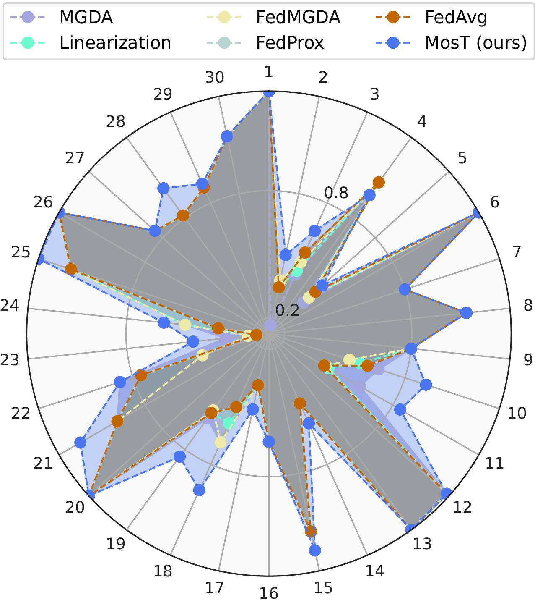

# MosT: Many-Objective Multi-Solution Transport

[](https://arxiv.org/pdf/2403.04099)

This repository contains the official implementation of the paper **"Many-Objective Multi-Solution Transport"**, which has been accepted for **ICLR 2025**. The paper introduces **MosT**, a novel algorithm designed for solving both many-objective (e.g., federated learning) and few-objective (e.g., ZDT problems) optimization scenarios.

MosT efficiently finds diverse solutions across the Pareto front, ensuring balanced trade-offs even when the number of objectives outnumbers the solutions. The algorithm outperforms state-of-the-art methods in several applications, including federated learning, multi-task learning, and mixture-of-prompt learning for large language models (LLMs).



---

## Installation

### Requirements
- Python 3.8+
- PyTorch 2.2.2
- pymoo==0.4.2.2
- cvxpy==1.6.2
- cvxopt==1.3.2

---

## Usage

### Many-objective Optimization (Federated Learning)

#### 1. Synthetic Data
```bash
# Example: Run MosT on synthetic federated learning
./synthetic.sh
```
**Key Parameters**:
- `--num_users`: Number of clients (default: 30)
- `--num_model`: Number of solutions/models (default: 5)
- `--epochs`: Training rounds (default: 100)
- `--syn_alpha`: Data heterogeneity level (range: 0.0-1.0)

#### 2. FEMNIST Dataset
```bash
# Example: Run MosT on FEMNIST
./femnist.sh
```
**Key Parameters**:
- `--num_users`: 206 (fixed for FEMNIST)
- `--model`: `cnn` for FEMNIST
- `--local_ep`: Local epochs per round (default: 4)

---

### Few-objective Optimization (ZDT Problems)
```bash
# Example: Run MosT on ZDT1 benchmark
./zdt.sh
```
**Key Parameters**:
- `--dataset`: `zdt1/zdt2/zdt3`
- `--preset_obj_num`: Number of extended objectives (default: 25)
- `--num_model`: Solutions to generate (default: 5)

---

## Code Structure
```
├── federated_moo.py        # Main training loop for federated learning
├── zdt_moo.py             # Main script for ZDT benchmarks
├── update.py              # Core algorithm (GlobalUpdate/LocalUpdate classes)
├── models.py              # Model architectures (CNNFemnist, LR)
├── utils.py               # Dataset loading and utilities
├── options.py             # Argument parser configurations
├── synthetic.sh           # Federated learning (synthetic data)
├── femnist.sh             # Federated learning (FEMNIST)
├── zdt.sh                 # ZDT benchmark experiments
└── requirements.txt       # Dependency list
```

---

## Citation
If you use this code or find our work helpful, please cite:
```bibtex
@article{li2024many,
  title={Many-objective multi-solution transport},
  author={Li, Ziyue and Li, Tian and Smith, Virginia and Bilmes, Jeff and Zhou, Tianyi},
  journal={arXiv preprint arXiv:2403.04099},
  year={2024}
}
```
